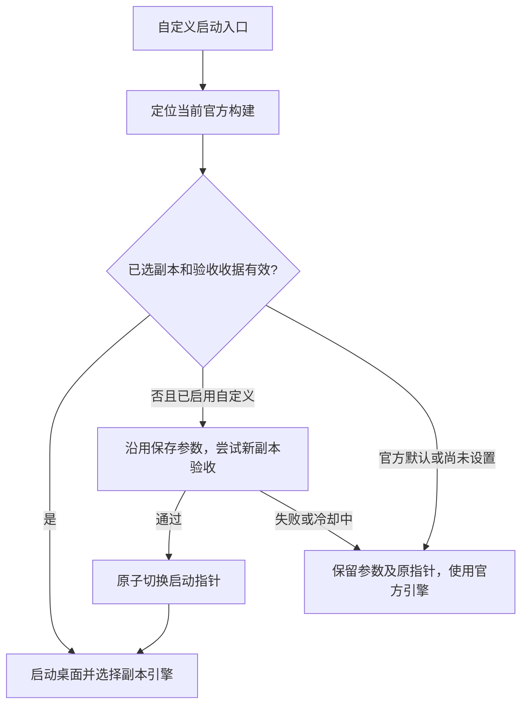

# 工作原理与边界

## 独立副本和启动选择

控制器不直接覆写官方安装。它从当前用户注册的 Codex 桌面包中读取引擎和同版本配套组件，在 `runtime/` 下创建新一代副本，对引擎应用可撤销的重试补丁；通过验收后才更新 `state/desktop-trial.json`。

```mermaid
flowchart TD
    A[自定义启动入口] --> B[定位当前官方构建]
    B --> C{已选副本和验收收据有效?}
    C -->|是| D[启动桌面并选择副本引擎]
    C -->|否且已启用自定义| E[沿用保存参数，尝试新副本验收]
    E -->|通过| F[原子切换启动指针]
    F --> D
    E -->|失败或冷却中| G[保留参数及原指针，使用官方引擎]
    C -->|官方默认或尚未设置| G
```

正式启动前还会重新检查进程与构建。桌面已运行时不会终止它来切换引擎；用户需要正常退出后重启。副本通过进程级 `CODEX_CLI_PATH` 提供给桌面，原环境和真实配置由 Codex 自行加载。官方入口独立保留。

## 重试补丁

`controller/native*.py` 使用 PE 结构和 x64 指令分析识别模型 HTTP/Responses/SSE 采样路径。新规则优先匹配字段关系、函数边界和分支控制流，而不是只匹配某个版本号或固定偏移。

### 原生返回值规则（0.169 构建已验证）

新版错误对象改用字节标签和跳转表，压缩也开始调用采样所用的原生错误分类器。`native_return.py` 从原生入口、返回空值、跳转表和 Debug 格式化流程推导标签位置与 String 字段；不从历史位图猜测新枚举编号。错误对象指针必须在分派后保持有效，采样和压缩调用者的 None 编码必须与分类器一致。

这一路径保留原生分类函数的全部指令、调用和异常展开记录，只把调用之后的 Duration 比较替换成一个叶辅助函数调用。辅助函数重新加载已证明的错误指针，在有效 Duration 上设置用户等待；明确终止继续返回 None。原生少数分支仅在缺少服务器截止时间时返回 None，这些分支通过“Duration 字段加载、空值比较、终止边、成对保存”的关系识别，改用用户等待，不写死错误编号。普通 429 在当前构建属于该结构，明确额度耗尽不属于。特殊 400 仍由同一枚举的 InvalidRequest Debug 名称、String 指针/长度和精准 JSON 字段匹配限制。

辅助函数不分配栈或修改非易失寄存器；按已证明的 RBP 栈槽或非易失寄存器读取错误指针。返回前重新比较 Duration 空值，使原有 JE/JNE 同时获得正确返回值和标志。保护页测试实际执行该辅助函数，检查非法指针、文本截断和 ZF。引擎本体只在临时副本中执行完整行为验收。

采样中的服务器截止时间使用整对加载范围替换，因此支持两个较短的 disp8 指令；被忽略的秒值随 None 纳秒标记一起成为无效截止时间。原有成对保存不变，外部分支不得进入替换范围内部。状态从同一帧槽恢复到另一寄存器时，预算跳转包含这条恢复指令；返回值规则允许易失状态寄存器，因为赋预算的辅助代码通过 JMP 执行并保持该寄存器。

新版压缩规则核对预算初始化、同一状态来源、错误对象复制位置、计数增量、分类器参数、成对 Duration 保存以及预算耗尽分支，统一设置预算和等待，同时忽略服务器截止时间。旧的直接退避调用结构继续使用旧规则。三处采样、两处 HTTP 和两处压缩的默认行为已通过验收，不代表逐一强制运行过所有编译实例或 feature 组合。

### 旧分类前缀与共享结构规则

对拆分函数后的实现，分类器追踪错误标签、寄存器别名、符号标志与原生终止位图的关系，沿用原构建的错误分类；HTTP 预算门则从指令推导计数器、状态字段和预算，核对字段不重叠、寄存器存活、分支边界及递增保存关系。枚举编号、寄存器分配和字段位置允许在这些关系成立时变化。

采样状态也可能在其他函数中构造，再传入重试循环。没有局部预算初始化的结构会额外核对预算、计数、Duration 字段互不重叠，错误参数来自同一栈槽，多个实例共享同一分类器和重试通知函数。通过后收集这些实例，在各自原预算比较前写入用户预算。重定向只替换连接路径入口的一条完整指令，预算赋值放在副本新增节内；中间的恢复块与跳转表目标保持原样。已经支持的局部初始化结构继续使用原规则。

Duration 保存和预算比较之间允许插入一条已证明的字段取址指令：来源必须是相同状态的计数或预算字段，目标是独立的非易失寄存器；指令保留在原位置执行。未证明的地址、寄存器破坏或分支进入补丁内部仍拒绝适配。这覆盖有限的编译器调度变化，不是跳过任意插入指令。

错误 Debug 分派从函数入口追踪原始标签、对象指针和 niche 常量，允许寄存器重分配，以及特殊错误分支之后才加载归一化常量。名称可以与其他可打印文本相邻，仍核对精确名称长度、枚举跳转表和 String 格式化字段。压缩计数器取址前也允许从同一栈槽重新加载状态到另一个寄存器；错槽或寄存器别名破坏仍会被拒绝。

新增的两类可恢复错误只扩展原生 `InvalidRequest` 分支。规则通过该枚举的 Debug 分发表和 `&String` 格式化器推导标签、文本指针及长度，再与采样分类器交叉检查；不写死枚举编号或 String 字段偏移。生成的辅助代码在 String 边界内匹配 JSON 的 `code` 完整值 `invalid_encrypted_content`，或 `message` 开头完整的资源不匹配说明（允许后接 trace 信息）。资源说明分为可选的已观察前缀 `OpenAI Responses bad request: `、固定原因、`Azure` 或 `***`、固定修复说明；字面量比较全部成功后才推进游标，省略前缀或切换名称时不会丢失位置。未知前缀、相似但不完整的说明、普通 `bad response`、其他 code、把 code 写进 message 的情况均不因此放开。它仍受现有外层预算限制。

错误名称引用按已要求的 `LEA RDX,[RIP+rel32]` 参数指令一次扫描所有执行节，同时匹配全部候选名称地址；避免每个名称重复进行通用全文件引用搜索。操作数内重叠、跨扫描块的候选仍保留，执行节末尾截断指令排除，之后的完整解码、分发表和字段关系检查不变。恢复时使用原始长度的内存视图核对完整摘要，变更撤销范围时仅对追加区补零，避免复制整份引擎来补几个字节；返回值仍是完整恢复后的不可变字节。

本地压缩有独立的默认预算和退避调用。规则从原生分类器的退避目标找到候选，检查预算初始化、计数器增量、同一异步状态来源、Duration 的成对保存及退出分支。当前构建识别到两份实现，均修改为用户配置；压缩中缩减历史的诊断文字仅作额外范围锚点。两份实现保留原有错误处理和历史缩减逻辑。独立远程压缩的另一份内联重试实现尚未适配，不据此声称所有压缩传输路径都受控。

精准错误判断需要更多指令空间，因此在独立副本尾部添加 `.cretry` 只读可执行节，修改经过校验的空闲节头、节数和大小字段；已有节权限及异常表保持原样。辅助函数只使用易失寄存器，不调用外部函数、不操作栈，通过相对 CALL 返回原流程。压缩使用同一等待生成器。格式 2 撤销记录同时保存原始长度与扩充长度，允许追加被中断时恢复，恢复后截回原长度并核对完整原始 SHA；格式 1 和旧补丁范围仍可撤销。

HTTP 状态对象可以通过完整的 64 位寄存器复制，或从同一未被改写的 RBP/RSP 栈槽恢复到另一寄存器。分类指令可以复用先前的状态寄存器，最终写回仍须指向已证明的同一对象，计数器仍须跨调用存活。这个有限顺序片段检查会跟踪子寄存器破坏、重叠栈写入、栈基址变化与地址逸出；调用会清除易失寄存器，并使 RSP 调用暂存区中的来源失效。分支若可能绕过必要恢复则拒绝。`0.165` 的旧规则只识别出另一条 HTTP 路径，零预算仍发出五次请求；完整行为验收因此拦截发布。状态来源证明修复后，两条路径都被识别，零预算恢复为一次请求。

`Option<Duration>` 的无等待标记从调用方的比较操作数推导，并独立核对分类器确实返回同一个值；不把十亿纳秒的数值边界当作所有构建的空值编码。支持相等与不相等分支的两种布局，分别追踪有效时长和错误清理路径。清理块即使被排到连接判断与预算块之间，也保留其原始字节，不作为补丁空间。HTTP 错误归一化允许原生有符号或无符号条件移动，仍核对标志来源和字段关系；补丁不改写这些分类指令。

连接特例被跳过时，预算路径仍需要原来的错误指针。若编译器把该指针的 R8 栈加载移入连接块，而预算路径在调用前没有重新写入 R8，规则核对它与分类器 RCX 参数来自同一栈槽，并检查通向预算块的分支及寄存器别名破坏。通过后在跳转前重放这条原生加载；栈偏移从当前指令推导。`0.164` 的首轮行为验收发现缺失该加载会造成访问违规，因此不能仅凭结构识别通过就发布。

原有采样和 HTTP 拆分函数规则不使用内部函数名、遥测名、日志或错误提示文字定位；新增错误布局和压缩规则的语义锚点见上文。独立 HTTP helper 必须能沿已解码直接调用追溯到 Responses 请求构造函数；端点须以指针和正确字节长度写入同一对象的相邻字段，单纯出现 `/responses` 文字不足以通过。允许最多四层包装，并核对包装链与共同模型调用者的连通关系；遍历最多 64 次，未知调用者、循环、超深、尾跳转、取函数地址或原始函数指针均拒绝。这个有限调用链检查不能证明所有动态间接调用路径。

同一构建可能同时保留多个 Responses HTTP 实现。当前规则收集全部通过结构与调用范围检查的 SSE 预算门，统一取消内部预算叠加；不按某个遥测名称优先选择一处。发现结构成立却无法证明调用范围的候选时，拒绝整个适配。是否改变预期请求次数、错误分类或恢复行为，仍由真实引擎验收判断；验收配置未覆盖的所有 feature 组合不能据此视为已验证。

旧精确家族规则继续保留，以兼容历史构建及撤销记录；其中仍存在固定指令、枚举或日志标记要求，不能把当前拆分函数规则的适应能力推广到全部旧规则。

相同原始字节的成功结构分析在当前进程内复用，以避免验收期间反复扫描整个引擎。每次调用仍计算完整 SHA-256，文件变化会重新分析，失败结果不缓存；跨分析只保留一份小型结构结果并向调用者返回独立副本，不保留可执行文件或反汇编对象。单次分析内部预建 PE 节区地址映射，复用最近一次函数解码、字符串引用与调用图查询结果，分析结束后释放。这些缓存不构成行为批准，也不替代构建、规则及验收收据校验。

状态检查先核对完整引擎摘要、规则摘要和全部必要验收场景。已有有效批准时直接报告兼容，不再重新反汇编同一构建；没有有效批准才做结构发现。写入阶段继续生成补丁并核对原字节，官方组件与发布收据仍逐项检查。冷结构发现先以轻量反汇编筛选 RIP 引用，再对命中函数完整解码；相对调用按映射区和 64 KiB 块筛选位移高字，保留重叠指令候选、块边界、取地址和尾跳转检查，最终仍由完整解码证明。

固定等待保留原来的立即数生成方式。随机扰动在同一个已证明的外层策略空间内生成：用时间戳计数器混合得到非密码学随机值，选择闭区间内的整数毫秒，再换算为秒与纳秒返回。只使用易失寄存器，不新增栈、共享状态、外部调用或线程；跨秒和零边界均由执行测试及真实引擎验收覆盖。老设置缺少 `jitter_ms` 时仍表示固定等待，零扰动按旧格式保存；不支持的旧精确结构明确拒绝非零扰动。

目标是让有限的模型外层逻辑拥有重试预算及固定或随机等待，避免内部重试叠加或无预算特例；普通 429 可使用该预算，明确配额耗尽仍结束，并保留其他错误原有分类。写入前检查原字节并保存恢复记录，撤销需要匹配记录与文件状态。

这仍依赖 Windows x64 ABI、PE 函数边界、Rust Duration 表示和支持的指令/控制流形态。协议端点指针与长度目前也要求相邻存储；编译器改用寄存器传参、动态拼接或不同指令调度时可能需要新规则。去掉名称依赖能减少纯重命名造成的失效，不能消除二进制补丁对内部实现的依赖。因此“结构识别失败即拒绝”和“每构建行为验收”仍是必要边界。

## 发布前的三层验收

1. 完整原生构建验收：固定等待 19 项，支持扰动的结构再增加三项，再增加错误与压缩范围的 32 项，共 54 项；覆盖错误分类、预算、毫秒等待、随机范围与变化、跨秒、服务端等待、流中断、连接恢复、app-server、1000 次预算及撤销。资源提示的原文、遮蔽名称及前缀组合均检查零预算、耗尽和成功，另检查压缩与误匹配拒绝。有效的同构建/同规则缓存可复用；声称支持扰动的批准必须包含全部扰动场景。
2. 本次参数验收：通过回环模拟 API 运行真实 app-server，并单独验证两类目标错误、带前缀且名称遮蔽的资源错误及手动、自动、回合结束压缩都读取本次参数。0～2 次预算验证耗尽；更高预算检查前两次重连后模拟成功，避免为百万次参数发出百万个测试请求。
3. 沙盒等价对照：原版和副本共六项 unelevated 场景，核对命令结果、受限令牌、工作区内外写入和代理环境。

原生验收最多使用四个工作线程。相同参数共用一个测试期间不再修改的引擎文件，当前 54 个场景对应十一组参数；各次请求探测仍使用各自的临时 CODEX_HOME、配置和回环端口。全部参数镜像制作及撤销恢复检查先完成，再启动计时探测，避免同进程的大块字节复制或补丁操作占用 Python GIL、延迟回环服务线程，造成毫秒等待误判。镜像由正式应用路径使用的 `build_plan` / `patched_bytes` 生成，写入后及全部探测结束后均核对完整摘要。耗时较长的千次预算场景提前排入队列，保留原请求数、等待断言和超时。

本次参数的六条范围探测也最多四路并发，各自使用独立配置和回环服务器，共用只读的待验收副本。结果按固定顺序收集，任何缺项、错误或工作线程异常均阻止发布；沙盒对照在这些参数检查全部通过后执行。

撤销检查在单独且不运行的文件上，通过真实 `Manager.apply` / `restore` 验证；先核对其产物与同参数测试镜像摘要完全一致，再完成原始摘要恢复、重复恢复、部分写入恢复及拒绝覆盖无关修改。任一任务失败均拒绝批准，取消排队任务并等待运行中的探测结束后清理临时文件；用户取消仍由工作进程的 Windows Job Object 回收整个进程树。并行测试会增加短时磁盘占用：当前引擎的十一份参数镜像、原版及恢复文件合计约 4 GiB，成功或常规失败后自动清理。与此前的临时验收目录一样，进程被强制终止时可能留下 state/.verification 下的目录，需在确认验证任务结束后清理；现有“清空历史副本”不覆盖该目录。

临时目录清理只针对本轮创建、位于指定 `.verification` 下的 `native-*` 目录。Windows 共享占用错误（32/33）允许在总计 15 秒内等待释放后继续清理，避免 Python 3.10 的临时目录错误处理将被占用的 EXE 误当目录、掩盖原始错误。它不重新执行验收、不更改权限、不结束占用进程；其他错误或持续占用仍报错，不能生成行为批准。

配套复制 `codex-code-mode-host.exe`、`codex-command-runner.exe`、`codex-windows-sandbox-setup.exe` 和 `rg.exe`，避免跨版本混用。发布前再次核对官方安装、组件、规则和报告，最后原子更新指针。上述过程使用临时配置、回环服务和虚构凭据，不依靠真实模型账号限流来验收。

沙盒对照中的未修改官方引擎与补丁副本都作为独立 override 进程启动，使用相同的 `windows_sandbox_service=true` 功能参数和临时 unelevated 配置。两个测试进程都清除从宿主继承的 `CODEX_WINDOWS_REGISTERED_CORE`、`CODEX_WINDOWS_SANDBOX_PACKAGE_FAMILY`；普通 `Popen` 不因 EXE 位于 WindowsApps 就获得 MSIX 包身份。当前桌面对自定义引擎也清除这两个标记。报告以 `standalone-override` 标明对照环境；六项结果继续逐项核对，但不将它们描述为已注册应用或服务式沙盒等价验收。

临时验收配置关闭插件功能，避免每个新测试进程同步外部插件目录。该配置只属于测试进程，不复制到正式运行副本或真实 CODEX_HOME；HTTP/SSE 重试、原版错误分类、参数和沙盒对照继续实测。HTTP/SSE 探测进程还显式设置 `RUST_LOG=warn`，确保命令行与桌面启动器都能采集原生等待日志；不改父进程、真实配置或正式桌面进程的日志级别。采样随机参数验收同时核对引擎记录的所选毫秒数和实际请求间隔；本地压缩没有该等待日志，使用实际间隔范围及变化验证，并由独立子进程执行测试检查同一等待生成器的毫秒范围。

## 两种更新

官方桌面更新由自定义启动器检测。引擎、桌面构建、配套组件或规则变化都可能要求新副本验收；桌面界面单独更新也会重新绑定构建。相同引擎和规则的完整批准缓存可复用，但不跳过本次发布所需检查。

自动失败按构建、规则与参数冷却 6 小时；变化后的构建或规则可再次尝试，手动保存/验证可立即重试。失败不覆盖原指针和保存参数，已选官方默认则不会被自动重新启用。

控制器源码更新由用户 `git pull` 完成，程序没有 GitHub 自动下载器。核心规则和验收程序参与摘要，更新后旧收据可能失效，需要重新验证。

## 存储、锁和进程

自动清理保留指针选中的副本与一代历史，运行中的引擎和配套进程额外保护；手动“清空历史副本”不额外保留历史。恢复官方后保留最后选中的一代。删除前核对目录边界、重解析点、指针和进程，先归档关键 JSON 收据；无法确认归属时跳过或停止，不结束运行进程。

保存、发布、清理与启动选择共享操作锁。锁文件保留不代表锁仍被持有；恢复必须实际尝试获取锁，不能删除文件绕过锁。提示框在释放锁之后显示。

后台工作进程及其测试子进程由 Windows Job Object 管理，取消、超时或父控制器退出时回收本项目任务。手动恢复先核对脚本/管理目录，再用进程句柄核对 PID、路径和创建时间，保护 Codex 桌面和聊天引擎。清理任务完成不等于未完成的参数已发布。

任务栏辅助进程是另一条独立路径，仅维护自定义启动的窗口身份和固定图标，详见[快捷方式说明](SHORTCUTS.md)。
